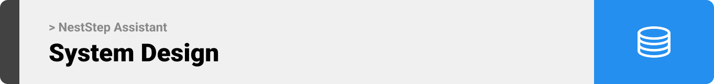

  

<!-- project overview -->

> NextStep AI is a comprehensive AI-powered career acceleration platform that transforms how professionals navigate their career journey. Acting as an intelligent career co-pilot, it seamlessly combines advanced job tracking, personalized skill development, and AI-driven content creation into one unified dashboard.

> The platform automatically monitors and categorizes job-related emails, builds customized learning roadmaps based on market demand, analyzes skills trends to identify high-value competencies, and leverages AI to generate professional content including LinkedIn posts, blog articles, email responses, and optimized job descriptions. With NextStep AI, users gain a strategic advantage through automated workflows, data-driven insights, and AI-powered tools that eliminate career management friction and accelerate professional growth in a competitive job market.

  

<!-- System Design -->

#### ER Diagram

#### Backend Components

#### Frontend Architecture

#### System Flowchart

  

<!-- Project Highlights -->

### Key Features

- **Intelligent Job Tracking & Management**
  - Automated email detection for job applications, interviews, and rejections
  - Real-time status updates from Gmail integration with zero manual input
  - Visual timeline of application journey with automated milestone tracking
  - Comprehensive application history with powerful filtering and analytics

- **Smart Email Intelligence Center**
  - Secure OAuth Gmail integration with privacy-first data handling
  - AI-powered classification of career-relevant communications
  - Automated extraction of deadlines, action items, and interview details
  - Priority inbox for time-sensitive career opportunities

- **Data-Driven Skills Analytics**
  - Real-time market trend analysis with demand forecasting
  - Personalized gap analysis between your skills and market requirements
  - Industry-specific technology adoption insights
  - Salary and hiring trend correlations with specific skill combinations

- **AI-Powered Career Development Hub**
  - Customized learning roadmaps based on your career goals and current skills
  - Dynamic step-by-step progression paths that adapt to your learning pace
  - Curated resource recommendations from trusted learning platforms
  - Progress tracking with milestone celebrations and accountability features

- **Content Creation Assistant**
  - Professional LinkedIn post generator optimized for engagement
  - Customizable blog content creation for personal branding
  - Smart email response drafting with tone and intent customization
  - Job description analyzer and response optimizer

- **AI Career Strategist**
  - Personalized career path recommendations based on your profile
  - Resume enhancement with industry-specific keyword optimization
  - Interactive mock interview preparation with feedback
  - Tailored upskilling recommendations based on desired roles

- **Seamless User Experience**
  - Intuitive, responsive dashboard that adapts to your workflow
  - Cross-device synchronization for on-the-go career management
  - Dark/light mode with customizable interface
  - Smart notifications and reminder system
### User Screens (Mobile)

| Login screen                            | Register screen                       | Dashboard                       |
| --------------------------------------- | ------------------------------------- | ------------------------------- |
|  |  |  |

### Admin Screens (Web)

| Job Analytics                           | User Management                       |
| --------------------------------------- | ------------------------------------- |
|  |  |

  

<!-- Development & Testing -->

### Development Stack

<table>
  <tr>
    <td><strong>Frontend</strong></td>
    <td>
      
      
    </td>
  </tr>
  <tr>
    <td><strong>Backend</strong></td>
    <td>
      
      
      
    </td>
  </tr>
  <tr>
    <td><strong>AI Services</strong></td>
    <td>
      
      
      
    </td>
  </tr>
  <tr>
    <td><strong>Email Integration</strong></td>
    <td>
      
      
    </td>
  </tr>
  <tr>
    <td><strong>Containerization</strong></td>
    <td>
      
    </td>
  </tr>
  <tr>
    <td><strong>Testing</strong></td>
    <td>
      
      
    </td>
  </tr>
  <tr>
    <td><strong>CI/CD</strong></td>
    <td>
      
    </td>
  </tr>
  <tr>
    <td><strong>Deployment</strong></td>
    <td>
      
    </td>
  </tr>
</table>
### Testing & Validation

| Unit Testing                           | Integration Testing                   | E2E Testing                        |
| --------------------------------------- | ------------------------------------- | ---------------------------------- |
| .png) |  | .png) |

  

<!-- Deployment -->

### Deployment Architecture

- **Infrastructure**: AWS EC2
  - Ubuntu Server 22.04 LTS
- **Database**: MYSQL:8:0
- **Automation Services**: 
  - n8n Cloud for workflow automation
  - Custom n8n nodes for AI Agent
  - Email processing workflows
- **AI Services**: OpenAI API

### API Documentation

| Authentication API                      | Job Tracking API                      | AI Services API                     |
| --------------------------------------- | ------------------------------------- | ----------------------------------- |
|  |  |  |

  
