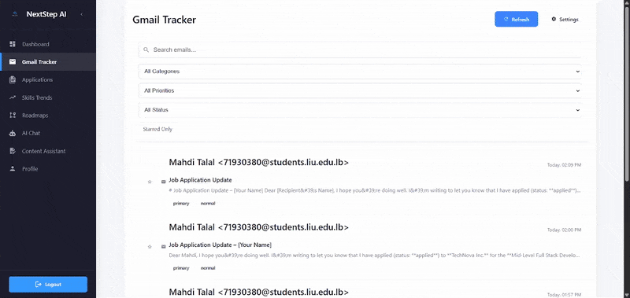
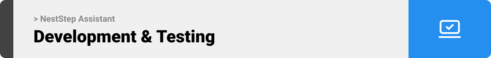

<br><br>

<!-- project overview -->


> NextStep AI is an AI-powered career acceleration platform that helps professionals navigate their career journey. It combines job tracking, skill development, and AI-driven content creation into one unified dashboard. The platform automatically monitors job-related emails, builds learning roadmaps, analyzes skills trends, and generates professional content using AI.

<br><br>

<!-- System Design -->


#### ER Diagram


#### System components


#### System Flowchart


<br><br>

<!-- Project Highlights -->


### Key Features
- **Intelligent Job Tracking & Management**

- **Smart Email Intelligence Center**

- **Data-Driven Skills Analytics**

- **AI-Powered Career Development Hub**

- **Content Creation Assistant**
- **AI Career Strategist**
- **Seamless User Experience**


### User Screens (Web)
| Landing Page                            | Landing page2                       |
| --------------------------------------- | ------------------------------------- |
|  |  |

| Dashboard                            | Ai agent                       |
| --------------------------------------- | ------------------------------------- |
|  |  |

|               Sign Up               |              User Profile               |
| :---------------------------------------: | :----------------------------------------: |
|  |  |

|               Job Email Tracker               |              Applications Jobs               |
| :---------------------------------------: | :----------------------------------------: |
|  |  |

|               Content Assistan Linkedin Post               |              Content Assistan JobDescription               |
| :---------------------------------------: | :----------------------------------------: |
|  |  |

|               AI Agent                |              Skills Analatics               |
| :---------------------------------------: | :----------------------------------------: |
|  |  |


<br><br>

<!-- Development & Testing -->


### Development Stack

|                                                                                                                Frontend                                                                                                                |                                                                                                                                                                  Backend                                                                                                                                                                  |                                                                                                                                                                AI Services                                                                                                                                                                |                                                                                                                    Email Integration                                                                                                                     |                                               Containerization                                               |                                                                                                            Testing                                                                                                            |                                                                 CI/CD                                                                  |                                                 Deployment                                                 |
| :------------------------------------------------------------------------------------------------------------------------------------------------------------------------------------------------------------------------------------: | :---------------------------------------------------------------------------------------------------------------------------------------------------------------------------------------------------------------------------------------------------------------------------------------------------------------------------------------: | :---------------------------------------------------------------------------------------------------------------------------------------------------------------------------------------------------------------------------------------------------------------------------------------------------------------------------------------: | :------------------------------------------------------------------------------------------------------------------------------------------------------------------------------------------------------------------------------------------------------: | :----------------------------------------------------------------------------------------------------------: | :---------------------------------------------------------------------------------------------------------------------------------------------------------------------------------------------------------------------------: | :------------------------------------------------------------------------------------------------------------------------------------: | :--------------------------------------------------------------------------------------------------------: |
|   |    |    |   |  |   |  |  |

### Testing & Validation

#### Unit Testing  
.png)

#### Integration Testing  


#### E2E Testing  
.png)
<br><br>

<!-- AI -->


### AI Features

- **Intelligent Content Generation**

  - Professional job descriptions with industry-specific requirements
  - Engaging LinkedIn posts optimized for professional networking
  - Thoughtful email responses with appropriate tone and context
  - Well-structured blog posts with SEO optimization

- **AI-Powered Career Assistant**

  - Real-time conversation with AI career advisor
  - Personalized career path recommendations
  - Skill gap analysis and learning recommendations
  - Resume optimization with industry-specific keywords

- **Smart Email Processing**

  - AI-powered email classification and categorization
  - Automated extraction of key information from emails
  - Intelligent response suggestions based on email context
  - Priority inbox management for career opportunities

- **Advanced Analytics**
  - Market trend analysis using AI models
  - Salary prediction based on skills and experience
  - Job demand forecasting for different industries
  - Skills gap analysis with personalized recommendations

### AI System Architecture

#### System Prompts

```javascript
// Job Description Prompt
"You are an expert recruiter. Create a professional job description with responsibilities and qualifications.";

// Email Reply Prompt
"You are a professional email expert. Write a clear, concise reply to the provided email.";
```

#### User Prompts

```javascript
// Job Description User Prompt
{
  jobTitle: "Senior Software Engineer",
  industry: "Technology"
}

// Email Reply User Prompt
{
  originalEmail: "Thank you for your application...",
  tone: "professional"
}
```

#### Response Validation

- Ensures the AI response is well-structured and meets minimum content requirements.
- Checks for required sections and appropriate length.

---

### AI Agent using N8N


**System Prompt for AI Agent:**

> You are a professional AI career assistant on the Next Step platform. You support users in advancing their careers by providing tailored guidance based on their questions and goals.
>
> You receive structured summary data (user profile, roadmaps, skills, and job applications) via a hook before each message. This data is for context only . do not repeat or reference it unless the user's message clearly requires it.
> Your responsibilities include:
>
> - Understanding and responding directly to user questions or goals.
> - When appropriate, using the user's profile, skills, roadmaps, or job applications to provide personalized suggestions.
> - Recommending next steps, resources, or optimizations related to career planning, skill development, and job search.
> - Staying focused on the user's intent without overexplaining or restating known context.
>
> Keep your tone helpful, precise, and professional. Prioritize clarity and actionability.

<br><br>

<!-- Deployment -->


### Deployment Architecture


Our deployment pipeline leverages GitHub Actions for CI/CD, Docker for containerization, and AWS EC2 & S3 for hosting:

- **CI/CD:** On every push to the `MT-staging` branch, GitHub Actions builds and pushes the backend Docker image to Docker Hub, builds the frontend, and deploys static assets to S3.
- **Backend:** The backend (Node.js, Express, Prisma) runs in a Docker container on an AWS EC2 instance, orchestrated via `docker-compose`.
- **Database:** MySQL runs as a separate container, with persistent storage.
- **Frontend:** The React frontend is built and deployed to AWS S3 for scalable, static hosting.
- **Secrets & Configuration:** All sensitive data and environment variables are injected securely via GitHub Secrets during the CI/CD process.

This architecture ensures automated, reliable, and scalable deployments for both backend and frontend services.
#### Postman API Documentation

- You can check the full API documentation using this [link](https://documenter.getpostman.com/view/33828343/2sB2qZE2ty).